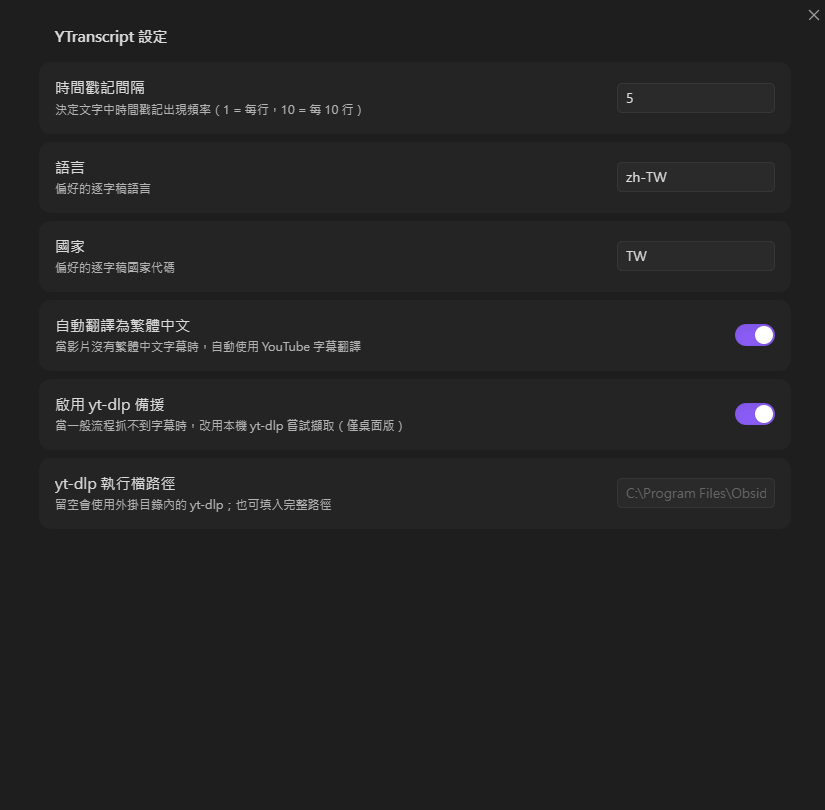

基於[lstrzepek/obsidian-yt-transcript](https://github.com/lstrzepek/obsidian-yt-transcript)優化

# 新增功能

## 支援多語言字幕

- 支援 YouTube 影片的翻譯字幕為繁體中文
- 字幕獲取失敗時，使用yt-dlp 獲取字幕

# 安裝方法
1. 下載 [ytranscript_ruide 1.3.0.1.zip](https://github.com/qwe840608/obsidian-yt-transcript/releases/download/v1.3.0.1/ytranscript_ruide.1.3.0.1.zip)
2. 解壓縮到你的obsidian plugins資料夾
3. 重啟Obsidian

## 截圖

# 使用方法

## 新功能：直接將 YouTube 逐字稿插入筆記（行動裝置友善）

1. 將游標移動到您想要插入逐字稿的位置
2. 執行指令：**"Insert YouTube transcript"** (插入 YouTube 逐字稿)
3. 插件會從以下來源偵測 YouTube 網址：
   - 編輯器中目前選取的文字
   - 系統剪貼簿
   - 手動輸入（備用方案）
4. 在提示字元中確認或編輯網址
5. 逐字稿將直接插入在游標位置，並帶有可點擊的時間戳記
6. 繼續在行內使用逐字稿內容撰寫筆記

這個新指令非常適合行動裝置使用者，並提供無縫的筆記體驗。

## 經典功能：側邊欄工作流（桌面版優化）

1. 在編輯器視窗中選取 YouTube 影片連結
2. 選擇選項 **YTranscript: Get Youtube transcript from selected url** 
3. 逐字稿將出現在帶有時間戳記的側邊視窗中 
4. 在設定中，您可以控制時間戳記出現的頻率（預設：每 32 行出現一次）
5. 點擊時間戳記可將影片跳轉至該位置
6. 右鍵點擊可複製全部內容
7. 您可以拖放逐字稿行或時間戳記連結

這兩種經典的側邊欄指令對於偏好傳統工作流的使用者仍然可用。

# 致謝

非常感謝以下插件的創作者與貢獻者：

-   [Auto Link Title](https://github.com/zolrath/obsidian-auto-link-title)
-   [Timestamp Notes](https://github.com/juliang22/ObsidianTimestampNotes)
-   [Recent Files](https://github.com/tgrosinger/recent-files-obsidian)
